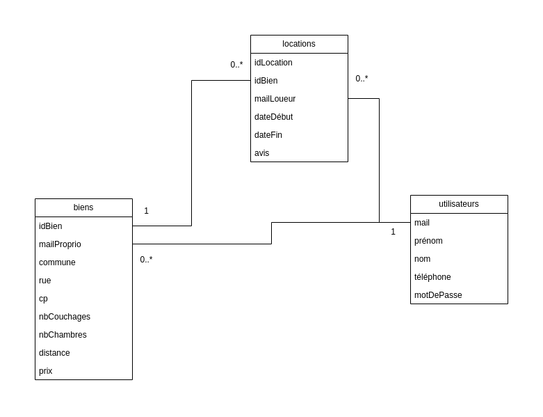
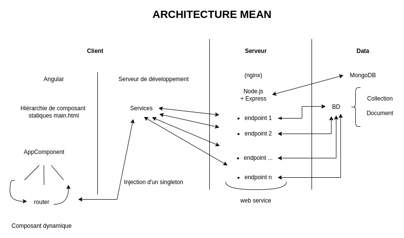

# Bienvenue à Nest - Votre Prochain Séjour, Simplifié !

## Contribution

Ce projet a été un effort collaboratif de **[VIGUIER Enzo](https://github.com/enzo-viguier)** et **[MILLA Aurélien](https://github.com/DenoxM)**.

## Introduction

**Nest** est une application web conçue pour la recherche et la réservation d'hébergements. Inspirée par les fonctionnalités familières de plateformes telles qu'AirBnB, Nest est construite en utilisant la puissante pile MEAN (MongoDB, Express, Angular et Node.js), offrant une expérience sans couture tant pour les propriétaires d'hébergements que pour les invités à la recherche du séjour parfait.

## À propos du Projet

Ce projet fait partie des exigences du cours HAI806I pour l'année académique 2023-2024, où nous avons été chargés de créer une application web pour la location de logements.

### Fonctionnalités Clés

- **Recherche Multi-critères** : Les utilisateurs peuvent filtrer leur recherche d'hébergement en fonction des dates de début et de fin, de l'emplacement, du prix, du nombre minimum de chambres, du nombre minimum de lits et de la distance maximale du centre-ville.
- **Listes d'Hébergements** : Parcourez les propriétés disponibles complètes avec des descriptions détaillées, des notes moyennes des invités précédents, et la capacité de réserver votre séjour.
- **Avis** : Après le séjour, les invités peuvent laisser une note pour référence future des invités.
- **Authentification des Utilisateurs** *(Fonctionnalité Bonus)* : Sécurité renforcée (avec Json Web Token) et expériences personnalisées grâce à la fonctionnalité de connexion des utilisateurs.

### Conception de la Base de Données

Notre base de données MongoDB abrite trois collections principales :
- **Utilisateurs** : Incluant l'email, le prénom, le nom de famille et le numéro de téléphone.
- **Propriétés** : Informations détaillées sur les propriétés locatives.
- **Locations** : Enregistrements des réservations, incluant les dates et les avis des invités.

## Pour Commencer

Pour exécuter Nest sur votre machine locale, assurez-vous d'avoir installé MongoDB, Node.js et Angular CLI.

### Server

#### Installation des dépendances

Installer les dépendances nécessaires au bon fonctionnement du projet.

```
npm install
```

#### Variables d'environnement

Crée un fichier .env à la racine du projet de cette structure :

```
MONGO_URL=
MONGO_BD_URL=
JWT_SECRET_KEY=
```

Exemple : 

```
MONGO_URL=mongodb://localhost:27017
MONGO_BD_URL=mongodb://localhost:27017/NEST
JWT_SECRET_KEY=JqlNx12izhQho4d64BABdwwRCsBR9u3t
```

#### Lancer le serveur

Pour lancer le serveur, il faut exécuter la commande suivant en étant dans le dossier server.

```
node server.js
```

Dans le dossier database, il y a trois fichiers .http qui sont des requêtes HTTP afin de remplir la base de données.
Les fichiers sont adapté pour une base de données Mongo en local. Modifier si nécessaire.

Pour exécuter rapidement ces requêtes HTTP, un script bash a été réalisé.

```
./load_database.sh
```

### Client

#### Installation des dépendances

Installer les dépendances nécessaires au bon fonctionnement du projet.

```
npm install
```

#### Lancement du client

Pour lancer le client, il faut lancer la commande suivante en étant dans le dossier client.

```
ng serve -o
```

### Technologies

#### Stack

- MongoDB
- Express
- Angular
- Node.js

#### Serveur
- Mongoose
- JWT (JsonWebToken)
- Cookie-Parser
- Bcrypt
- Axios
- Cors
- Dotenv

### Schémas

#### Base de données Mongo



### Architecture MEAN 




## Remerciements

Un merci spécial à Pierre Pompidor pour nous avoir guidés à travers ce cours (HAI806I) ainsi que ce projet. Nest a été une incroyable opportunité d'appliquer nos connaissances et compétences dans un cadre pratique.